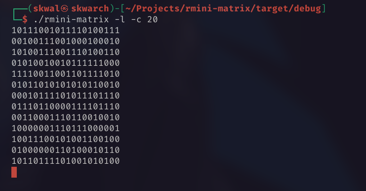
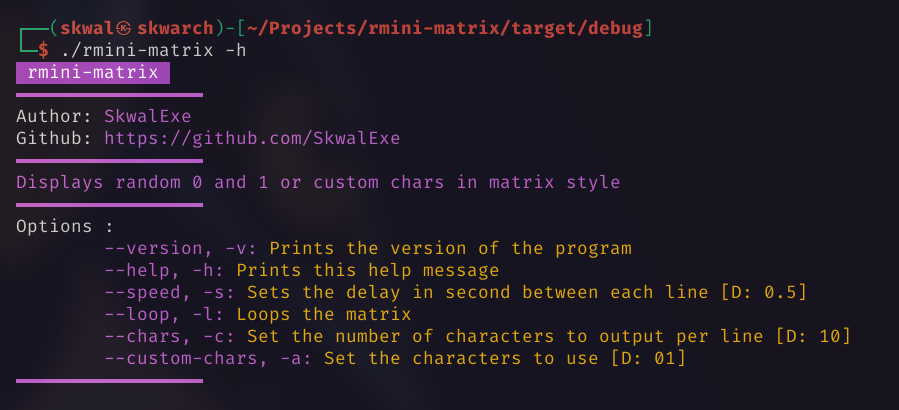
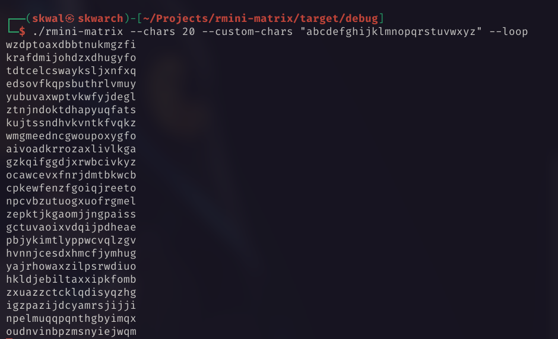
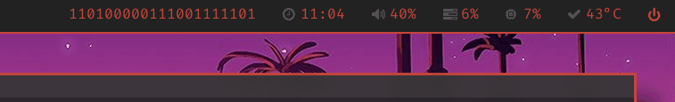

# Rust Mini matrix



🦀 rust implementation of mini-matrix - much faster

👨‍💻 Output random 0 and 1 or custom characters with a matrix-like effect

# Installation 📦

## Arch Linux 🐧

rmini-matrix is in the AUR

```bash
yay -S rmini-matrix
```

## Other 🪟🐧

### With make - Linux 🐧

Run make

```bash
# 📂 rmini-matrix/
make
```

### Build from source - Linux 🐧 & Windows 🪟

clone github repo

```bash
git clone https://github.com/SkwalExe/rmini-matrix
```

build with [cargo](https://doc.rust-lang.org/cargo/getting-started/installation.html)

```bash
# 📂 rmini-matrix/
cargo build --release
```

**[ LINUX ONLY ] :** Move the binary

```bash
# 📂 rmini-matrix/
sudo cp target/release/lsd-print /usr/bin/lsd-print
```

**On windows** the executable will be `target\release\lsd-print.exe` you can move it wherever you want.

# Usage 



## Example

`rmini-matrix -c 20 --custom-chars "abcdefghijklmnopqrstuvwxyz"`



## Example with polybar  

```ini
[module/matrix]
type = custom/script
exec = rmini-matrix -c 20 -s 0.07
tail = true
```



# Uninstall 🗑

## With make

Run make uninstall

```bash
# 📂 rmini-matrix/
make uninstall
```

## Or

Just remove the binary

```bash
sudo rm /usr/bin/rmini-matrix
```

# Docker 🐳

### Build 🛠️

```bash
# 📂 rmini-matrix/
docker build -t rmini-matrix .
```

### Run 🏃

```bash
docker run --rm -it rmini-matrix [OPTIONS]
```

# final

If you have any probleme, don't hesitate to open an issue

# contributing

Pull requests are welcome. For major changes, please open an issue first to discuss what you would like to change.

<a href="https://github.com/SkwalExe#ukraine"></a>